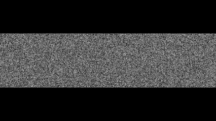

## 동적 공명 모자이크 - 인터랙티브 시각적 챌린지 컨셉

이 프로젝트는 OCR과 AI 분석에 점점 더 취약해지는 정적인 CAPTCHA 시스템을 넘어선, 새로운 방식의 인간 인증 시스템 컨셉을 탐구합니다. 이 시스템은 정적인 이미지를 제시하는 대신, **움직임 속도의 차이로 발생하는 '공명 현상(Sympathetic Resonance)'**을 통해서만 숨겨진 텍스트를 인지할 수 있는 완전한 동적/상호작용형 모자이크를 생성합니다.




### 기존 CAPTCHA 시스템의 문제점

표준 CAPTCHA 시스템은 왜곡되었지만 **정적인** 텍스트에 의존합니다. OCR 봇은 단순히 이미지 프레임 하나를 캡처하고 분석하는 것만으로 내용을 해독할 수 있습니다. 이 근본적인 약점은 캡챠의 복잡성과 봇의 정교함 사이의 끝없는 군비 경쟁으로 이어졌습니다. 상호작용이 필요한 최신 시스템조차도, 시각적 챌린지 자체가 정적이고 분석 가능한 요소에 기반한다면 결국 뚫릴 수밖에 없습니다.

### 우리의 접근 방식: 움직임을 통한 해결책 - 정적 분석의 무력화

이 시스템은 **어떠한 '정적인 상태'도 제거함으로써** 전통적인 OCR을 무력화시킵니다. 캔버스의 모든 픽셀이 결정론적인 알고리즘 패턴에 따라 끊임없이 변화하기 때문에, 봇이 비교할 수 있는 "이전"과 "이후" 이미지가 존재하지 않습니다.

인간은 단일 프레임을 분석해서가 아니라, **서로 다른 시간적 주파수(temporal frequencies)가 만들어내는 경계**를 인식함으로써 숨겨진 단어를 인지할 수 있습니다. 인간의 시각 시스템은 움직임 속에서 패턴을 감지하는 데 매우 뛰어난 반면, 단순한 컴퓨터 비전 알고리즘은 이러한 동적 패턴 분석에 어려움을 겪습니다.

#### 작동 방식 - 핵심 원리

1.  **알고리즘 기반 노이즈:** 전체 캔버스는 모자이크 블록으로 채워집니다. 각 블록의 색상은 무작위가 아니며, 블록의 좌표, 마우스 위치, 그리고 계속 증가하는 `time` 변수를 입력값으로 하는 결정론적 노이즈 함수에 의해 실시간으로 계산됩니다.

2.  **공명 현상 (공명 변상):** 이 시스템의 핵심입니다.
    *   보이지 않는 텍스트 마스크가 "텍스트 영역"과 "배경 영역"이라는 두 구역을 정의합니다.
    *   두 영역은 **정확히 동일한 노이즈 알고리즘**을 사용합니다.
    *   하지만 알고리즘에 입력되는 `time` 변수는 각 영역마다 다른 속도 계수(`textSpeed`와 `backgroundSpeed`)와 곱해집니다.
    *   이것이 바로 "시각적 맥놀이(beat)" 또는 공명 효과를 만들어냅니다. 텍스트 영역은 하나의 주파수로, 배경은 다른 주파수로 깜빡입니다. 결과적으로 어떤 단일 프레임을 보아도 균일한 랜덤 노이즈처럼 보일 뿐이지만, 인간의 눈은 두 움직임의 차이로 인해 형성되는 글자의 형태를 쉽게 인지할 수 있습니다.

3.  **정적 정보의 부재:** 단일 프레임을 캡처하는 봇은 랜덤 노이즈 외에는 아무것도 얻을 수 없습니다. 이 시스템을 뚫기 위해서는, 봇이 수천 개의 블록이 깜빡이는 주파수를 동시에 추적하는 등 비디오 스트림에 대한 복잡한 시간적 분석을 수행해야만 합니다. 이는 정적인 OCR보다 훨씬 더 어려운 작업입니다.

### 주요 기능

-   **완전한 동적 캔버스:** 정적인 요소가 전혀 존재하지 않아 단일 프레임 분석을 무의미하게 만듭니다.
-   **인터랙티브 마우스 추적:** 사용자의 마우스 위치에 따라 노이즈 패턴이 변화하여 또 다른 차원의 동적인 상호작용을 더합니다.
-   **설정 가능한 시각적 요소:**
    -   숨겨진 `TEXT`를 쉽게 변경할 수 있습니다.
    -   텍스트의 `lineWidth`를 조절하여 더 두껍거나 얇게 만들 수 있습니다.
    -   `pixelSize`를 조절하여 더 크거나 작은 모자이크 블록을 생성할 수 있습니다.
-   **조정 가능한 공명 효과:** `textSpeed`, `backgroundSpeed`, `globalSpeed` 등의 값을 미세 조정하여 인간에게는 잘 보이고 봇에게는 더 어려운 최적의 균형점을 찾을 수 있습니다.

### 사용법 및 커스터마이징

시작하려면 `.html` 파일을 웹 브라우저에서 열기만 하면 됩니다. 모든 주요 파라미터는 HTML 파일 내 `<script>` 섹션 상단에서 쉽게 조정할 수 있습니다.

```javascript
<script>
    // ... (캔버스 설정)

    // --- 주요 설정 값 ---
    const TEXT = "PASSWORD";          // 숨겨진 단어
    const pixelSize = 5;              // 각 모자이크 블록의 크기 (예: 5는 5x5 픽셀을 의미)
    
    // 텍스트 스타일
    const FONT_STYLE = 'bold 100px Arial';
    const FONT_THICKNESS = 6;         // 텍스트 외곽선 두께 조절

    // 공명 및 속도 제어
    const textSpeed = 400;            // 텍스트 영역의 움직임 속도 계수
    const backgroundSpeed = 2.5;      // 배경 영역의 움직임 속도 계수
    const timeIncrement = 0.0025;     // 전체 애니메이션 속도 제어

    // ... (나머지 코드)
</script>
```

## Dynamic Resonance Mosaic - An Interactive Visual Challenge Concept

This project explores a novel approach to human verification, moving beyond static CAPTCHAs that are increasingly vulnerable to OCR and AI analysis. Instead of presenting a static image, this system generates a fully dynamic and interactive mosaic where the hidden text is only perceptible through the phenomenon of **sympathetic resonance**, a visual effect created by differential motion speeds.


### The Problem with Modern CAPTCHAs

Standard CAPTCHA systems rely on distorted but static text. An OCR bot can simply capture a single image frame and analyze it to decipher the content. This fundamental weakness has led to an arms race between CAPTCHA complexity and bot sophistication. Even systems requiring interaction can be compromised if the visual challenge itself is based on static, analyzable elements.

### Our Approach: Deception Through Motion

This system neutralizes traditional OCR by **eliminating any static state**. There is no "before" and "after" image to compare because every pixel on the canvas is constantly changing in a deterministic, algorithmic pattern.

A human can perceive the hidden word not by analyzing a single frame, but by recognizing a **boundary created by different temporal frequencies**. The human visual system is exceptionally good at detecting patterns in motion, an area where simple computer vision algorithms struggle.

#### How It Works - The Core Principles

1.  **Algorithmic Noise:** The entire canvas is filled with mosaic blocks. The color of each block is not random, but is calculated in real-time by a deterministic noise function. This function takes the block's coordinates, the mouse position, and a constantly increasing `time` variable as inputs.

2.  **Sympathetic Resonance (공명 변상):** This is the key to the system.
    *   An invisible text mask defines two zones: the "text area" and the "background area".
    *   Both zones use the **exact same noise algorithm**.
    *   However, the `time` variable fed into the algorithm is multiplied by a different speed factor for each zone (`textSpeed` vs. `backgroundSpeed`).
    *   This creates a "visual beat" or resonance effect. The text area flickers at one frequency, while the background flickers at another. Although any single frame looks like uniform random noise, the human eye easily perceives the shape formed by the area of different motion.

3.  **No Static Information:** A bot capturing a single frame will see nothing but random-looking noise. To break the system, a bot would need to perform complex temporal analysis on a video stream, tracking the flicker frequency of thousands of blocks simultaneously—a significantly harder task than static OCR.

### Features

-   **Fully Dynamic Canvas:** No static elements exist, making single-frame analysis useless.
-   **Interactive Mouse Tracking:** The noise pattern shifts based on the user's mouse position, adding another layer of dynamic interaction.
-   **Configurable Visuals:**
    -   Easily change the hidden `TEXT`.
    -   Adjust text `lineWidth` to make it thicker or thinner.
    -   Control the `pixelSize` to create larger or smaller mosaic blocks.
-   **Tunable Resonance Effect:** Fine-tune `textSpeed`, `backgroundSpeed`, and `globalSpeed` to find the optimal balance between visibility for humans and difficulty for bots.

### Usage and Customization

To get started, simply open the `.html` file in a web browser. All key parameters can be easily adjusted at the top of the `<script>` section in the HTML file.

```javascript
<script>
    // ... (canvas setup)

    // --- MAIN CONFIGURATION ---
    const TEXT = "PASSWORD";          // The hidden word
    const pixelSize = 5;              // Size of each mosaic block (e.g., 5 means 5x5 pixels)
    
    // Text style
    const FONT_STYLE = 'bold 100px Arial';
    const FONT_THICKNESS = 6;         // Adjusts the stroke width of the text

    // Resonance and Speed Controls
    const textSpeed = 400;            // Speed multiplier for the text area's motion
    const backgroundSpeed = 2.5;      // Speed multiplier for the background's motion
    const timeIncrement = 0.0025;     // Controls the overall animation speed

    // ... (rest of the code)
</script>
```

This project serves as a proof-of-concept demonstrating how principles of motion and human visual perception can be used to create more robust and bot-resistant challenge systems.
